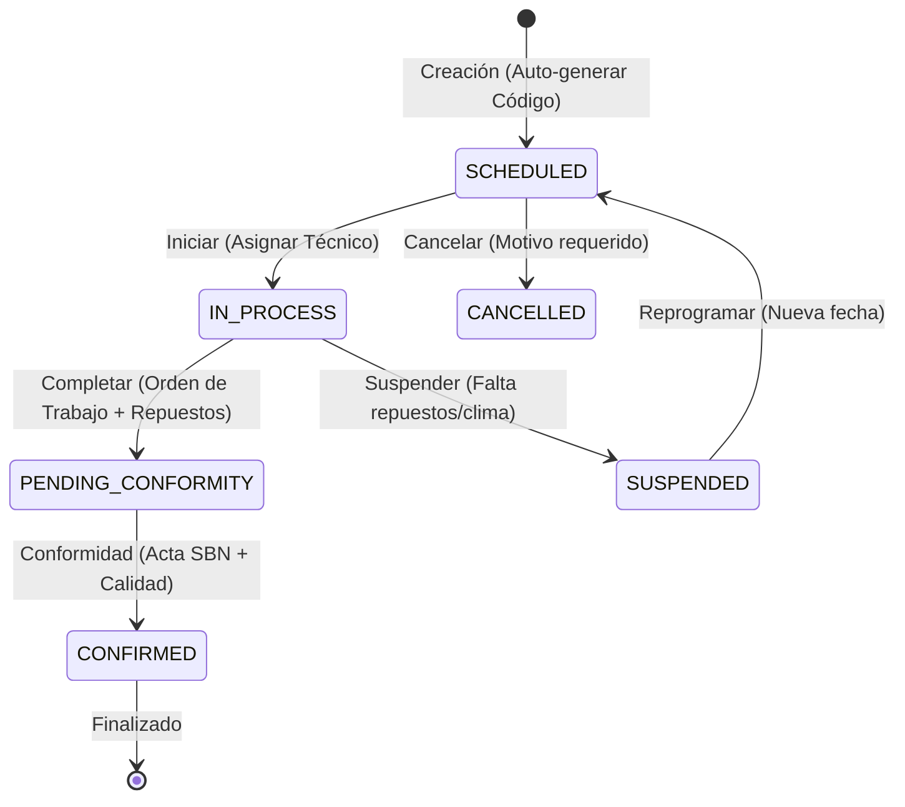

<div align="center">

# &#x1F527; Microservicio de Mantenimiento

**Gestión integral de mantenimientos de activos municipales**

[](https://openjdk.org/)
[](https://spring.io/projects/spring-boot)
[](https://docs.spring.io/spring-framework/reference/web/webflux.html)
[](https://www.postgresql.org/)
[](/)

</div>

---

## &#x1F4CB; Descripcion

Microservicio **reactivo** (no-bloqueante) para administrar el ciclo de vida completo de los mantenimientos de activos municipales: programacion, ejecucion, seguimiento, costos y documentacion. Construido sobre **Arquitectura Hexagonal** estricta con Spring WebFlux y R2DBC.

---

## &#x1F3D7;&#xFE0F; Arquitectura Hexagonal

El proyecto sigue una **Arquitectura Hexagonal (Ports & Adapters)** con separacion estricta de responsabilidades entre capas.

```
                    ┌──────────────────────────────┐
                    │      REST Controller         │
                    │   (Adaptador de Entrada)     │
                    │    DTO ←→ Domain Model       │
                    └──────────────┬───────────────┘
                                   │
                    ┌──────────────▼───────────────┐
                    │    MaintenanceServicePort     │
                    │     (Puerto de Entrada)       │
                    │    Solo tipos de dominio      │
                    └──────────────┬───────────────┘
                                   │
                    ┌──────────────▼───────────────┐
                    │     MaintenanceUseCase        │
                    │   (Logica de Negocio)         │
                    │  Validacion + Orquestacion    │
                    └──────────────┬───────────────┘
                                   │
                    ┌──────────────▼───────────────┐
                    │  MaintenanceRepositoryPort    │
                    │     (Puerto de Salida)        │
                    └──────────────┬───────────────┘
                                   │
                    ┌──────────────▼───────────────┐
                    │   PersistenceAdapter          │
                    │  (Adaptador de Salida)        │
                    │  Domain ←→ R2DBC Entity       │
                    └──────────────┬───────────────┘
                                   │
                    ┌──────────────▼───────────────┐
                    │        PostgreSQL             │
                    │     (Base de Datos)           │
                    └──────────────────────────────┘
```

### &#x1F512; Reglas de Dependencia

| Regla | Estado |
|-------|--------|
| Domain &#x2192; Application | &#x1F6AB; Prohibido |
| Domain &#x2192; Infrastructure | &#x1F6AB; Prohibido |
| Application &#x2192; Infrastructure | &#x1F6AB; Prohibido |
| Application &#x2192; Domain | &#x2705; Permitido |
| Infrastructure &#x2192; Domain | &#x2705; Permitido |
| Infrastructure &#x2192; Application | &#x2705; Permitido |

---

## &#x1F4C2; Estructura del Proyecto

```
src/main/java/pe/edu/vallegrande/ms_maintenanceService/
│
├── MsMaintenanceServiceApplication.java          # Punto de entrada
│
├── domain/                                        # Nucleo de negocio (sin dependencias externas)
│   ├── model/
│   │   └── Maintenance.java                       # Modelo de dominio puro (POJO)
│   ├── valueobject/
│   │   └── AttachedDocument.java                  # Value Object de documento adjunto
│   ├── exception/
│   │   ├── MaintenanceServiceException.java       # Excepcion base del servicio
│   │   ├── MaintenanceNotFoundException.java      # Mantenimiento no encontrado
│   │   ├── MaintenanceValidationException.java    # Error de validacion
│   │   └── DuplicateMaintenanceCodeException.java # Codigo duplicado
│   └── port/
│       ├── in/
│       │   └── MaintenanceServicePort.java        # Puerto de entrada (solo tipos dominio)
│       └── out/
│           └── MaintenanceRepositoryPort.java     # Puerto de salida (persistencia)
│
├── application/                                   # Orquestacion y casos de uso
│   ├── dto/
│   │   ├── MaintenanceRequestDTO.java             # DTO de creacion/actualizacion
│   │   ├── MaintenanceResponseDTO.java            # DTO de respuesta
│   │   ├── StartMaintenanceRequest.java           # DTO para iniciar
│   │   ├── CompleteMaintenanceRequest.java        # DTO para completar
│   │   ├── SuspendMaintenanceRequest.java         # DTO para suspender
│   │   ├── CancelMaintenanceRequest.java          # DTO para cancelar
│   │   ├── RescheduleMaintenanceRequest.java      # DTO para reprogramar
│   │   ├── UpdateMaintenanceRequest.java          # DTO para actualizacion parcial
│   │   ├── StatusUpdateRequest.java               # DTO para cambio de estado
│   │   └── ErrorResponse.java                     # DTO de respuesta de error
│   ├── mapper/
│   │   └── MaintenanceMapper.java                 # Domain <-> DTO
│   ├── usecase/
│   │   └── MaintenanceUseCase.java                # Implementa MaintenanceServicePort
│   └── validator/
│       └── MaintenanceValidator.java              # Reglas de negocio
│
└── infrastructure/                                # Adaptadores e infraestructura
    ├── adapter/
    │   ├── in/rest/
    │   │   └── MaintenanceController.java         # Adaptador REST (convierte DTO <-> Domain)
    │   └── out/persistence/
    │       ├── MaintenanceEntity.java             # Entidad R2DBC (@Table, JSONB)
    │       ├── MaintenanceR2dbcRepository.java    # ReactiveCrudRepository
    │       ├── MaintenancePersistenceAdapter.java # Implementa RepositoryPort
    │       └── MaintenancePersistenceMapper.java  # Domain <-> Entity + JSONB
    ├── config/
    │   ├── BeanConfig.java                        # Wiring hexagonal (conecta puertos)
    │   ├── CorsConfig.java                        # Configuracion CORS
    │   ├── JacksonConfig.java                     # Serializacion JSON
    │   └── SwaggerConfig.java                     # Documentacion OpenAPI
    └── exception/
        └── GlobalExceptionHandler.java            # Manejo centralizado de errores
```

---

## &#x1F680; Stack Tecnológico

| Tecnología | Versión | Propósito |
|------------|---------|-----------|
| **Java** | 17 | Lenguaje de programación |
| **Spring Boot** | 3.5.11 | Framework principal |
| **Spring WebFlux** | 6.2.16 | API reactiva no-bloqueante (Mono/Flux) |
| **Spring Data R2DBC** | Latest | Acceso reactivo a base de datos |
| **SweetAlert2** | Latest | Interfaz de usuario para notificaciones (Frontend) |

---

## &#x1F504; Diagrama de Estados (Ciclo de Vida SBN)

El servicio sigue estrictamente el flujo de estados requerido por la normativa de control patrimonial:



**Transiciones Clave:**

| Origen | Destino | Regla de Negocio |
|--------|---------|------------------|
| `IN_PROCESS` | `PENDING_CONFORMITY` | Requiere al menos un repuesto/parte registrado y costo de mano de obra. |
| `PENDING_CONFORMITY` | `CONFIRMED` | Genera automáticamente el **Número de Acta de Conformidad** (`CONF-UBIGEO-AÑO-N`). |

---

## &#x2728; Funcionalidades Implementadas

### 1. Automatización de Códigos (SBN Compliant)
*   **Código de Mantenimiento**: Generado al crear (`MNT-UBIGEO-TIPO-AÑO-CORRELATIVO`).
*   **Orden de Trabajo**: Propuesto automáticamente al completar el trabajo técnico.
*   **Acta de Conformidad**: Generada al confirmar la recepción del trabajo (`CONF-UBIGEO-AÑO-CORRELATIVO`).

### 2. Integración Cross-Service (Secure WebClient)
*   **Patrimonio**: Extracción automática de la descripción y código patrimonial del bien mediante WebClient con propagación de tokens JWT.
*   **Tenant/Muni**: Obtención del código de **Ubigeo** dinámico para la construcción de códigos oficiales.
*   **Configuración**: Gestión de proveedores y catálogos de repuestos.

### 3. Gestión de Costos e Integridad
*   **Cálculo Reactivo**: Subtotales de repuestos calculados en tiempo real.
*   **Columnas Generadas**: Uso de `GENERATED ALWAYS` en base de datos para garantizar que el `total_cost` sea siempre exacto (Mano de obra + Repuestos + Adicionales).

---

## &#x1F52E; Próximas Mejoras (Roadmap)

### Sincronización Automática de Estados
*   [ ] **Bloqueo en Patrimonio**: Al pasar a `IN_PROCESS`, enviar un `PATCH` al microservicio de Patrimonio para cambiar el estado del bien a `EN_MANTENIMIENTO`.
*   [ ] **Liberación de Activo**: Al pasar a `CONFIRMED`, devolver el estado del bien a `OPERATIVO` en el módulo de Patrimonio.
*   [ ] **Evidencia Fotográfica**: Integración con servicio de almacenamiento para fotos de "Antes" y "Después".
*   [ ] **Alertas Preventivas**: Notificaciones push/correo cuando un activo se acerque a su fecha programada.

---

## &#x1F310; API Endpoints

**Base URL:** `http://localhost:5007/api/v1/maintenances`

### Operaciones CRUD

| Metodo | Endpoint | Descripcion |
|--------|----------|-------------|
| `POST` | `/` | Crear nuevo mantenimiento (estado inicial: `SCHEDULED`) |
| `GET` | `/` | Listar todos los mantenimientos |
| `GET` | `/{id}` | Obtener mantenimiento por ID |
| `PUT` | `/{id}` | Actualizar mantenimiento completo |

### Operaciones de Ciclo de Vida

| Metodo | Endpoint | Descripcion |
|--------|----------|-------------|
| `POST` | `/{id}/start` | Iniciar mantenimiento (`SCHEDULED` &#x2192; `IN_PROCESS`) |
| `POST` | `/{id}/complete` | Completar mantenimiento (`IN_PROCESS` &#x2192; `COMPLETED`) |
| `POST` | `/{id}/suspend` | Suspender mantenimiento (`IN_PROCESS` &#x2192; `SUSPENDED`) |
| `POST` | `/{id}/cancel` | Cancelar mantenimiento (`SCHEDULED` &#x2192; `CANCELLED`) |
| `POST` | `/{id}/reschedule` | Reprogramar mantenimiento (`SUSPENDED` &#x2192; `SCHEDULED`) |

### Filtros

| Metodo | Endpoint | Descripcion |
|--------|----------|-------------|
| `GET` | `/status?status={estado}` | Filtrar por estado |

### Documentacion Interactiva

| Recurso | URL |
|---------|-----|
| Swagger UI | `http://localhost:5007/swagger-ui.html` |
| OpenAPI JSON | `http://localhost:5007/api-docs` |

---

## &#x1F4DD; Ejemplos de Uso

### Crear Mantenimiento

```bash
curl -X POST http://localhost:5007/api/v1/maintenances \
  -H "Content-Type: application/json" \
  -d '{
    "municipalityId": "11111111-1111-1111-1111-111111111111",
    "maintenanceCode": "MANT-2025-001",
    "assetId": "22222222-2222-2222-2222-222222222222",
    "maintenanceType": "PREVENTIVE",
    "priority": "HIGH",
    "scheduledDate": "2025-11-20",
    "workDescription": "Mantenimiento preventivo trimestral del sistema HVAC",
    "reportedProblem": "Filtro obstruido y vibracion anormal",
    "technicalResponsibleId": "33333333-3333-3333-3333-333333333333",
    "serviceSupplierId": "44444444-4444-4444-4444-444444444444",
    "hasWarranty": true,
    "warrantyExpirationDate": "2026-11-20",
    "requestedBy": "55555555-5555-5555-5555-555555555555",
    "attachedDocuments": [
      { "fileUrl": "https://example.com/images/foto_equipo.jpg" }
    ]
  }'
```

### Iniciar Mantenimiento

```bash
curl -X POST http://localhost:5007/api/v1/maintenances/{id}/start \
  -H "Content-Type: application/json" \
  -d '{
    "updatedBy": "66666666-6666-6666-6666-666666666666",
    "observations": "Inicio de mantenimiento programado"
  }'
```

### Completar Mantenimiento

```bash
curl -X POST http://localhost:5007/api/v1/maintenances/{id}/complete \
  -H "Content-Type: application/json" \
  -d '{
    "workOrder": "WO-2025-001",
    "laborCost": 150.00,
    "partsCost": 50.00,
    "appliedSolution": "Se reemplazo el filtro HVAC",
    "observations": "Trabajo completado exitosamente",
    "updatedBy": "66666666-6666-6666-6666-666666666666",
    "completionDocument": {
      "fileUrl": "https://example.com/images/recibo_final.jpg"
    }
  }'
```

---

## &#x1F5C4;&#xFE0F; Modelo de Datos

### Tabla: `maintenances`

| Campo | Tipo | Descripcion |
|-------|------|-------------|
| `id` | `UUID` | Identificador unico (PK) |
| `municipality_id` | `UUID` | ID del municipio |
| `maintenance_code` | `VARCHAR(50)` | Codigo unico del mantenimiento |
| `asset_id` | `UUID` | ID del activo |
| `maintenance_type` | `VARCHAR(30)` | `PREVENTIVE`, `CORRECTIVE`, `PREDICTIVE`, `EMERGENCY` |
| `is_scheduled` | `BOOLEAN` | Si esta programado |
| `priority` | `VARCHAR(20)` | `LOW`, `MEDIUM`, `HIGH`, `CRITICAL` |
| `scheduled_date` | `DATE` | Fecha programada |
| `start_date` | `TIMESTAMP` | Fecha de inicio real |
| `end_date` | `TIMESTAMP` | Fecha de finalizacion |
| `next_date` | `DATE` | Proxima fecha (recurrentes) |
| `work_description` | `TEXT` | Descripcion del trabajo |
| `reported_problem` | `TEXT` | Problema reportado |
| `applied_solution` | `TEXT` | Solucion aplicada |
| `observations` | `TEXT` | Observaciones con historial |
| `technical_responsible_id` | `UUID` | ID del tecnico responsable |
| `service_supplier_id` | `UUID` | ID del proveedor de servicio |
| `labor_cost` | `DECIMAL(10,2)` | Costo de mano de obra |
| `parts_cost` | `DECIMAL(10,2)` | Costo de repuestos |
| `total_cost` | `DECIMAL(10,2)` | Costo total (calculado) |
| `maintenance_status` | `VARCHAR(30)` | Estado actual del mantenimiento |
| `work_order` | `VARCHAR(100)` | Numero de orden de trabajo |
| `attached_documents` | `JSONB` | Documentos adjuntos en formato JSON |
| `has_warranty` | `BOOLEAN` | Si tiene garantia |
| `warranty_expiration_date` | `DATE` | Fecha de vencimiento de garantia |
| `requested_by` | `UUID` | ID del solicitante |
| `created_at` | `TIMESTAMP` | Fecha de creacion |
| `updated_by` | `UUID` | ID del ultimo actualizador |
| `updated_at` | `TIMESTAMP` | Fecha de ultima actualizacion |

---

## &#x2699;&#xFE0F; Configuracion

### Variables de Entorno

| Variable | Descripcion | Valor por Defecto |
|----------|-------------|-------------------|
| `SERVER_PORT` | Puerto del servidor | `5007` |
| `R2DBC_URL` | URL de conexion R2DBC | - |
| `R2DBC_USERNAME` | Usuario de base de datos | - |
| `R2DBC_PASSWORD` | Contrasena de base de datos | - |
| `SPRING_PROFILES_ACTIVE` | Perfil activo de Spring | `default` |
| `TZ` | Zona horaria | `America/Lima` |

---

## &#x1F6E0;&#xFE0F; Desarrollo Local

### Prerrequisitos

- **Java** 17 o superior
- **Maven** 3.9 o superior
- **PostgreSQL** 14+ (o acceso a Neon)

### Compilar y Ejecutar

```bash
# Compilar
mvn clean compile

# Ejecutar
mvn spring-boot:run

# O con el Maven Wrapper
./mvnw spring-boot:run        # Linux/Mac
mvnw.cmd spring-boot:run      # Windows

# Empaquetar
mvn clean package
java -jar target/ms-maintenanceService-0.0.1-SNAPSHOT.jar
```

### Ejecutar Tests

```bash
mvn test
```

---

## &#x1F433; Docker

### Construir Imagen

```bash
docker build -t ms-maintenance-service:1.0.0 .
```

### Ejecutar Contenedor

```bash
docker run -d \
  --name maintenance-service \
  -p 5007:5007 \
  -e SPRING_PROFILES_ACTIVE=prod \
  -e R2DBC_URL=r2dbc:postgresql://host:5432/ms-maintenanceService \
  -e R2DBC_USERNAME=usuario \
  -e R2DBC_PASSWORD=contrasena \
  ms-maintenance-service:1.0.0
```

---

## &#x1F50D; Monitoreo

### Spring Actuator

| Endpoint | Descripcion |
|----------|-------------|
| `/actuator/health` | Estado de salud del servicio |
| `/actuator/info` | Informacion de la aplicacion |
| `/actuator/metrics` | Metricas de rendimiento |

```bash
curl http://localhost:5007/actuator/health
```

---

## &#x1F512; Seguridad y Validaciones

| Mecanismo | Descripcion |
|-----------|-------------|
| Jakarta Bean Validation | Validacion de datos de entrada en DTOs |
| Validacion de estados | Transiciones controladas con reglas de negocio |
| Codigos unicos | Prevencion de duplicados en `maintenanceCode` |
| CORS | Configuracion de origenes permitidos |
| Manejo global de errores | Respuestas estructuradas consistentes |

### Formato de Error

```json
{
  "timestamp": "2025-11-14T10:30:00",
  "status": 400,
  "error": "Bad Request",
  "message": "Mensaje descriptivo del error",
  "path": "/api/v1/maintenances"
}
```

---

## &#x1F3AF; Patrones de Diseno

| Patron | Implementacion |
|--------|----------------|
| **Hexagonal (Ports & Adapters)** | Separacion en Domain, Application, Infrastructure |
| **Repository Pattern** | `MaintenanceRepositoryPort` + `PersistenceAdapter` |
| **Use Case Pattern** | `MaintenanceUseCase` implementa el puerto de entrada |
| **DTO Pattern** | DTOs en capa Application, conversion en adaptadores |
| **Mapper Pattern** | `MaintenanceMapper` (DTO) + `PersistenceMapper` (Entity) |
| **Builder Pattern** | Construccion de objetos con Lombok `@Builder` |

---

## &#x1F4C4; Licencia

Proyecto desarrollado por **Valle Grande** para la gestion de activos municipales.

---

<div align="center">

**Desarrollado por Valle Grande** &#x2022; Arquitectura Hexagonal &#x2022; Spring WebFlux &#x2022; R2DBC

</div>
