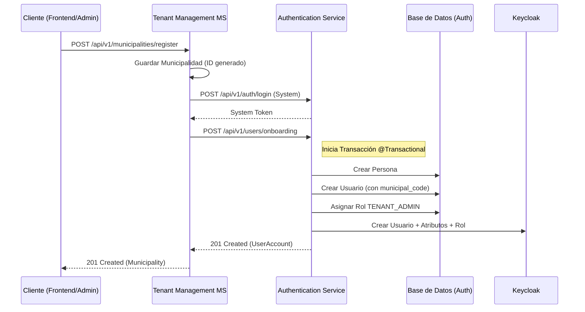

# Refactorización del Proceso de Onboarding de Tenants

Este documento describe los cambios realizados en el microservicio **vg-ms-tenantmanagmentservice** (Tenant Management) y su nueva integración con el **Authentication Service** para el alta automatizada de municipalidades.

## 1. Contexto del Cambio

Anteriormente, el servicio de municipalidades realizaba una orquestación manual compleja (múltiples llamadas de red) para crear el administrador de una nueva municipalidad. Esto era frágil y difícil de mantener.

**Cambio realizado:** Se ha centralizado la lógica de creación de usuarios administrativos en un nuevo endpoint de "Onboarding" dentro del Authentication Service, simplificando la responsabilidad del Microservicio de Municipalidades.

## 2. Cambios en el Microservicio de Tenant

### 2.1 Nuevo DTO: [TenantOnboardingRequestDto](file:///c:/ArchivosClases/HenryJr/sipreb/vg-ms-autenticationservice/src/main/java/edu/pe/vallegrande/AuthenticationService/infrastructure/adapter/in/web/dto/TenantOnboardingRequestDto.java#15-35)
Se creó para encapsular la información mínima necesaria que requiere el Auth Service para dar de alta a un administrador.
- Ubicación: [application/dto/TenantOnboardingRequestDto.java](file:///c:/ArchivosClases/HenryJr/sipreb/vg-ms-tenantmanagmentservice/src/main/java/pe/edu/vallegrande/configurationservice/application/dto/TenantOnboardingRequestDto.java)

### 2.2 Actualización de Puertos y Adaptadores
- **AuthClientPort**: Se añadió el contrato [onboardTenant](file:///c:/ArchivosClases/HenryJr/sipreb/vg-ms-autenticationservice/src/main/java/edu/pe/vallegrande/AuthenticationService/domain/ports/in/UserService.java#92-96).
- **AuthClientAdapter**: Se implementó la llamada REST hacia el nuevo endpoint `POST /api/v1/users/onboarding` del Authentication Service.

### 2.3 Refactorización de [MunicipalityService](file:///c:/ArchivosClases/HenryJr/sipreb/vg-ms-tenantmanagmentservice/src/main/java/pe/edu/vallegrande/configurationservice/application/service/MunicipalityService.java#28-363)
Se eliminó la lógica redundante de mapeo de personas y asignación de roles manual.

**Antes:**
1. Crear Municipalidad en BD.
2. Login en Auth Service.
3. Buscar ID del rol "ADMIN".
4. Crear Persona en Auth Service.
5. Crear Usuario en Auth Service.
6. Asignar Rol en Auth Service.

**Ahora (Flujo de Onboarding):**
1. Crear Municipalidad en BD.
2. Login en Auth Service (Sistema).
3. **Llamada única a [onboardTenant](file:///c:/ArchivosClases/HenryJr/sipreb/vg-ms-autenticationservice/src/main/java/edu/pe/vallegrande/AuthenticationService/domain/ports/in/UserService.java#92-96)**: El Auth Service se encarga de todo el proceso interno de forma atómica.

## 3. Funcionamiento Actual (Diagrama)

## 4. Beneficios Obtenidos

| Beneficio | Descripción |
| :--- | :--- |
| **Atomicidad** | Si falla la creación en Keycloak, el Auth Service puede revertir la creación del usuario en la BD gracias a `@Transactional`. |
| **Seguridad de Tenant** | El `municipal_code` se inyecta desde el momento cero tanto en la BD como en Keycloak, garantizando el aislamiento de datos. |
| **Mantenibilidad** | Si los requisitos para un nuevo admin cambian (ej. nombre de rol, permisos base), solo se modifica el Auth Service. |
| **Simplicidad** | El código de orquestación en el MS de Municipalidades se redujo en más de un 60%. |

## 5. Endpoints Involucrados

| Servicio | Método | Path | Descripción |
| :--- | :--- | :--- | :--- |
| **Auth** | POST | `/api/v1/users/onboarding` | Procesa el alta masiva de Persona/Usuario/Rol/Keycloak. |
| **Tenant** | POST | `/api/v1/municipalities/register` | Orquestador principal del onboarding. |

---
> [!IMPORTANT]
> Asegúrese de que el rol `TENANT_ADMIN` exista en la base de datos del Authentication Service (como rol global) antes de ejecutar el proceso de onboarding para una nueva municipalidad.
